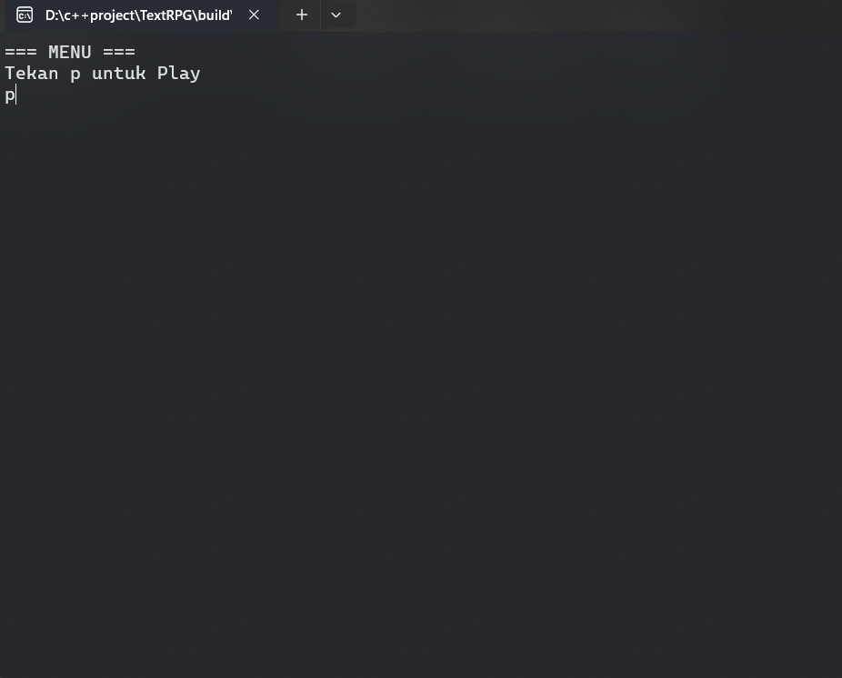

<h1 align="center">Turn Based Console RPG</h1>

<p align="center">
A cross-platform, console-based turn-based RPG built as a learning project to explore industry-grade C++ organization, OOP, and scalable architecture to demonstrate core game programming fundamentals such as game loop, state machine, turn system, and basic combat logic.
</p>

<h1 align="center">Gameplay</h1>

<p align="center">
  
  
  
</p>

<p align="center">
  
</p>

<h1 align="center">Features</h1>

- Turn-based combat system (Player vs Enemy)
- State Machine driven game flow: Menu → Playing → Win / Game Over
- Enemy AI with random actions
- Defense mechanic (blocks one hit)
- Restart without quitting the game
- Clean architecture ready for scaling
- Cross-platform (Windows / Linux / macOS)
- Command & Observer patterns for input and events
- Object Pool for enemy management

<h1 align="center">Controls</h1>

| Key | Action |
|-----|--------|
| P   | Start Game from Menu |
| W   | Move |
| A   | Attack |
| D   | Defend |
| Q   | Quit |
| R   | Restart (on Win or Game Over) |

<h1 align="center">Build Instructions</h1>

### Windows
```bash
cmake -S . -B build
cmake --build build
.\build\Debug\Turn_Based_Console_RPG.exe
```
### Linux/MacOS
```bash
cmake -S . -B build
cmake --build build
./build/Turn_Based_Console_RPG
```
<h1 align="center">Architecture</h1>

-   **GameManager** → Singleton controlling the main loop    
-   **StateMachine** → Controls current game state (Menu, Playing, Win, GameOver)
-   **GameState** → Base class for all game state
-   **Entities** → Player and Enemy with health & actions
-   **Command Pattern** → Handles Player input
-   **Observer Pattern** → Player death notification triggers GameOver
-   **Object Pool** → Reuses Enemy objects efficiently
